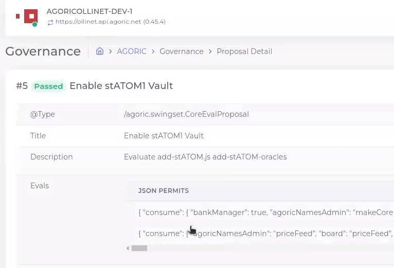
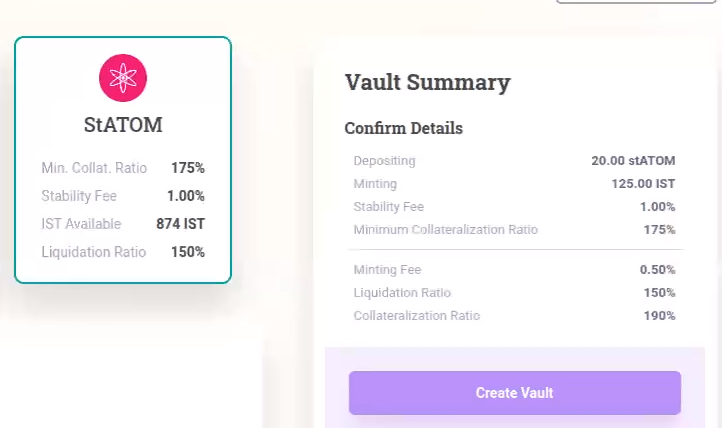

## Summary

This repositrory contains code and instructions for submitting a [`swingset.CoreEval`](https://docs.agoric.com/guides/coreeval/) proposal to the [Agoric](https://github.com/Agoric/agoric-sdk/) blockchain. CoreEval is a special type of governance proposal that executes code after a passing vote. 

Specifically, this is a proposal for adding `stATOM` as a collateral type to [Inter Protocol](https://github.com/Agoric/agoric-sdk/tree/master/packages/inter-protocol) Vaults. See the [community discussion](https://community.agoric.com/t/onboard-statom-as-collateral/410) for more details.

This proposal can easily be adapted for other collerateral types, and should serve as a reference for future proposals. You can see a demo and discussion of this code recorded during developer [office hours](https://github.com/Agoric/agoric-sdk/discussions/8240).

## Preqrequisites

### 1. Use Proposal Builder to generate Core Eval files

See [inter-protocol/scripts/add-STARS.js](https://github.com/Agoric/agoric-sdk/blob/5a00ae14aedb7d4a5f1e60c4bc9d79814089c99b/packages/inter-protocol/scripts/add-STARS.js) and this npm [script](https://github.com/Agoric/agoric-sdk/blob/5a00ae14aedb7d4a5f1e60c4bc9d79814089c99b/packages/inter-protocol/package.json#L13) for more details.

I have checked in the generated files here for reference. The files were generated with [this fork](https://github.com/Agoric/agoric-sdk/compare/master...0xpatrickdev:agoric-sdk:pc/statom-vault-proposal-issuerName), using the added `yarn build:add-stATOM-proposal` script.


Alternatively, you can edit the files provided here directly, adjusting the sections highlighted:

 - [add-stATOM.js](https://github.com/0xpatrickdev/agoric-vault-collateral-proposal/blob/pc/readme-updates/add-stATOM.js#L9-L18)
 - [add-stATOM-oracles.js](https://github.com/0xpatrickdev/agoric-vault-collateral-proposal/blob/pc/readme-updates/add-stATOM-oracles.js#L8-L45)

### 2. Setup wallet

One wallet is needed for submitting governance proposals, and two* wallets are required for submitting oracle prices.

```zsh
# list current keys
agd keys list
# add a new key, with auto-generated mnemonic
agd keys add [dev-local]
# add a new key, with custom mnemonic
agd keys add [dev-local] --interactive
# prints address
agd keys show [dev-local] -a
```

* two if `minSubmissionCount` in `decentral-devnet-config.json` is set to `2`

### 2.a Setting up hardware wallet
 
Ledger hardware wallet signing is supported by agd, and can be set up as follows:

```zsh
agd keys add [my-ledger] --ledger --coin-type=118 [--account=0] [--index=0]
# use the hw key to sign and submit a tx
agd tx swingset [...] --from=[my-ledger] --sign-mode=amino-json
```

### 3. Request faucet funds + Provision Wallet

Setup a smart-wallet and request funds here: https://devnet.faucet.agoric.net/, using the address from the previous step.

In a local environment, the following `cosmic-swingset` Makefile commands will help achieve the same:
```zsh
cd ~/agoric-sdk/packages/cosmic-swingset
# fund provision pool
make fund-provision-pool
# create a smart wallet
ACCT_ADDR=your-address make provision-acct
# add faucet tokens to wallet
ACCT_ADDR=your-address FUNDS=9999000000ubld,9999000000uist make fund-acct
```

## Proposal Steps

### 1. Deploy bundles
_Before deploying bundles, you will want to query the chain [1.a.](#1a-verify-bundle-deployment) to see if they are already published. If they are, which is likely the case for a Vault Collateral Proposal, you can avoid the gas cost of deploying them again and skip this step._

```zsh
NODE=https://devnet.rpc.agoric.net:443
WALLET=dev-local
CHAIN_ID=agoricdev-20
B1=b1-1c8e93cc80b28b2cf6b1252e9b6edb0253a1f962889f8a255397b43984950a263dd9c9efd82aee5744b46e7bd57ff1c733030e9f4dc8da9b355b185a59687862.json
B2=b1-8fb229296073327ed26d2a1ac56eda2bdc70c99d68621895a88f6cc09bce2defa3bd0894e97950e5a0696388193279c8f6b9399809611f8fec3ef5aeed355ba5.json
B3=b1-c185bf3b0d7cf940a4f6d6ca1cd74a5d0f5ff330be1cfceaa6c5e4204ba1196e92444e086bf03573371216f41941d1b0fc8560984e2da09f2edd412e46dd62e3.json
B4=b1-e4ba9cb60b5b59d4d4618710991fe8a503dd4a07c7f17029a342ccb41893bc961ae63bcb0e2c20e4bc2415c9755f090f7761751cdd00b85762902b357a48c5cf.json

cd bundles
agd tx swingset install-bundle @$B1 --node $NODE --from $WALLET --chain-id $CHAIN_ID --gas=auto --gas-adjustment=1.2 -y
agd tx swingset install-bundle @$B2 --node $NODE --from $WALLET --chain-id $CHAIN_ID --gas=auto --gas-adjustment=1.2 -y
agd tx swingset install-bundle @$B3 --node $NODE --from $WALLET --chain-id $CHAIN_ID --gas=auto --gas-adjustment=1.2 -y
agd tx swingset install-bundle @$B4 --node $NODE --from $WALLET --chain-id $CHAIN_ID --gas=auto --gas-adjustment=1.2 -y
```
_Alternatively, the `deploy-bundles.sh` script can be used to ensure only un-published bundles are submitted._


### 1.a. Verify Bundle Deployment
```zsh
# returns a global list of deployed bundles
agd query vstorage children swingStore.bundle --node $NODE
# query for a specific bundle
agd query vstorage data swingStore.bundle.[bundle id] --node $NODE
```

### 2. Submit Governance Proposal

```zsh
NODE=https://devnet.rpc.agoric.net:443
WALLET=dev-local
CHAIN_ID=agoricdev-20
agd tx gov submit-proposal swingset-core-eval \
  add-stATOM-permit.json add-stATOM.js \
  add-stATOM-oracles-permit.json add-stATOM-oracles.js \
  --title="Enable stATOM Vault" --description="Evaluate add-stATOM.js add-stATOM-oracles.js" --deposit=1000000ubld \
  --gas=auto --gas-adjustment=1.2 \
  --node $NODE --from $WALLET --chain-id $CHAIN_ID
```

### 3. Query Gov Proposals

```zsh
NODE=https://devnet.rpc.agoric.net:443
WALLET=dev-local
CHAIN_ID=agoricdev-20
agd query gov proposals --node $NODE --chain-id $CHAIN_ID --output json | \
  jq -c '.proposals[] | [.proposal_id,.voting_end_time,.status]';
```

### 4. Vote on Gov Proposal

```zsh
NODE=https://devnet.rpc.agoric.net:443
WALLET=dev-local
CHAIN_ID=agoricdev-20
agd tx gov vote 1 yes --node $NODE --from $WALLET --chain-id $CHAIN_ID
```




## Oracle Steps

Before, ensure at least two addresses you control is listed in `oracleAddresses`. You may also want to adjust `minSubmissionCount` from `3` to `2` in `decentral-devnet-config.json`.

```zsh
cd ~/agoric-sdk
WALLET=dev-local
NODE=https://localhost:26657
WALLET=dev-local
WALLET_2=dev-local-2
CHAIN_ID=agoriclocal
alias oracle="yarn run --silent agops oracle"

# accept the offer to submit a price
oracle accept --offerId 1 --pair stATOM.USD > offer-1-w1.json
agoric wallet send --from $WALLET --offer offer-1-w1.json

# push a price
oracle pushPriceRound --price 10 --roundId 1 --oracleAdminAcceptOfferId 1 > price-offer-1-w1.json
agoric wallet send --from $WALLET --offer price-offer-1-w1.json

# verify price feed
agoric follow :published.priceFeed.stATOM-USD_price_feed

# submit a price from wallet 2
AGORIC_NET=devnet oracle accept --offerId 1 --pair stATOM.USD > offer-1-w2.json
AGORIC_NET=devnet agoric wallet send --from $WALLET_2 --offer offer-1-w2.json
AGORIC_NET=devnet oracle pushPriceRound --price 10 --roundId 1 --oracleAdminAcceptOfferId 1 > price-offer-1-w2.json
AGORIC_NET=devnet agoric wallet send --from $WALLET_2 --offer price-offer-1-w2.json
```

When using the agops cli, the network can be specified by prefacing commands with `AGORIC_NET=devnet`.

## Open a Vault with agops cli
```zsh
alias vaults="yarn run --silent agops vaults"
AGORIC_NET=devnet vaults open --wantMinted 5.00 --giveCollateral 9.0 --collateralBrand stATOM > open-vault-offer.json
AGORIC_NET=devnet agoric wallet send --from $WALLET --offer open-vault-offer.json
```


## UI Validation

_A link to an endorsed UI can be found on https://devnet.agoric.net/._




## REPL Validation

```js
// request a loan for 5m uist (the minimum)
E(E(home.agoricNames).lookup('issuer', 'IST')).getBrand()
istBrand = history[n]
fiveMillionUistAmount = { brand: istBrand, value: 5_000_000n}

// find the vault factory instance
E(home.agoricNames).lookup('instance', 'VaultFactory')
vfi = history[n]

// open an ATOM vault
E(E(home.agoricNames).lookup('issuer', 'ATOM')).getBrand()
atomBrand = history[n]
atomPurse = E(home.wallet).getPurse("ATOM")
oneMillionUatomAmount = { brand: atomBrand, value: 1_000_000n}
proposal = { give: { Collateral: oneMillionUatomAmount }, want: { Minted: fiveMillionUistAmount } }
E(atomPurse).withdraw(oneMillionUatomAmount)
pmt = { Collateral: history[n] }
E(E(E(home.zoe).getPublicFacet(vfi)).getCollateralManager(atomBrand)).makeVaultInvitation()
inv = history[n]
E(home.zoe).offer(inv, proposal, pmt)
E(history[n]).getOfferResult() // should provide a VaultSeatKit, or show an error

// open an stATOM vault
E(E(home.agoricNames).lookup('issuer', 'stATOM')).getBrand()
stAtomBrand = history[n]
stAtomPurse = E(home.wallet).getPurse("stATOM")
oneMillionUstAtomAmount = { brand: stAtomBrand, value: 1_000_000n}
proposal = { give: { Collateral: oneMillionUstAtomAmount }, want: { Minted: fiveMillionUistAmount } }
E(stAtomPurse).withdraw(oneMillionUstAtomAmount)
pmt = { Collateral: history[n] }
E(E(E(home.zoe).getPublicFacet(vfi)).getCollateralManager(stAtomBrand)).makeVaultInvitation()
inv = history[n]
E(home.zoe).offer(inv, proposal, pmt)
E(history[n]).getOfferResult() // should provide a VaultSeatKit, or show an error
```

## REPL Oracle Validation

```js
E(home.agoricNames).lookup('oracleBrand', 'stATOM')
E(home.agoricNames).lookup('oracleBrand', 'USD')
stAtomOracleBrand = history[n]
E(home.priceAuthority).makeQuoteNotifier({ value: 10n * 10n ** 6n, brand: stAtomOracleBrand }, usdOracleBrand)
E(qn).getUpdateSince()
```